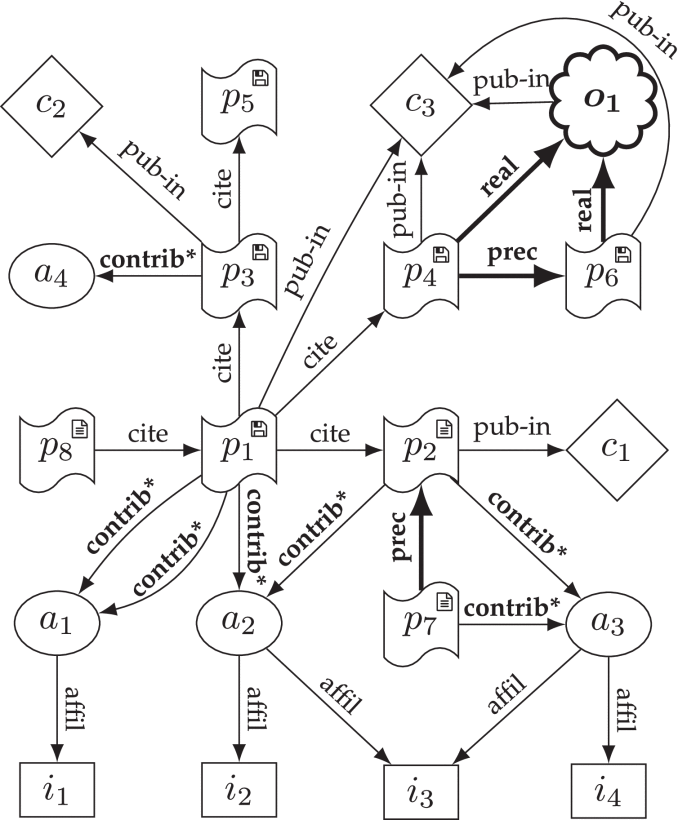

# About me

I am a **doctoral researcher** in computer science at the [Institute of Software Technology](https://www.dlr.de/sc/en/) of the [German Aerospace Center (DLR)](https://www.dlr.de/EN/Home/home_node.html) and the [Department of Computer Science](https://www.informatik.hu-berlin.de/en/), [Humboldt-Universität zu Berlin](https://www.hu-berlin.de/en), and a **Fellow of the [Software Sustainability Institute (SSI)](https://software.ac.uk/)**.

In the [past](#past-projects) I have worked as a [Research Software Engineer](https://de-rse.org/en/) in linguistics and the digital humanities projects, and as Managing Editor at Wiley-Blackwell.

{ width="300"; align="right"; }

## Research interests

- Research software citation
- Research software sustainability
- Research software publication
- Research software metadata

For my **PhD**, I'm developing a way to measure the impact of dependencies on research software, 
to enable transitive credit and make [hidden but important research dependencies](https://xkcd.com/2347/) more visible.

## Education

I have received my **Magister Artium (MA)** in English (major), Modern German Literature, and General and German Linguistics (minor) from the [Free University Berlin](https://www.fu-berlin.de/en/) in 2010.

## Personal

I live in Berlin, Germany, with my partner and our three kids.
