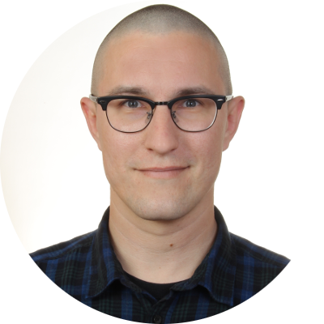
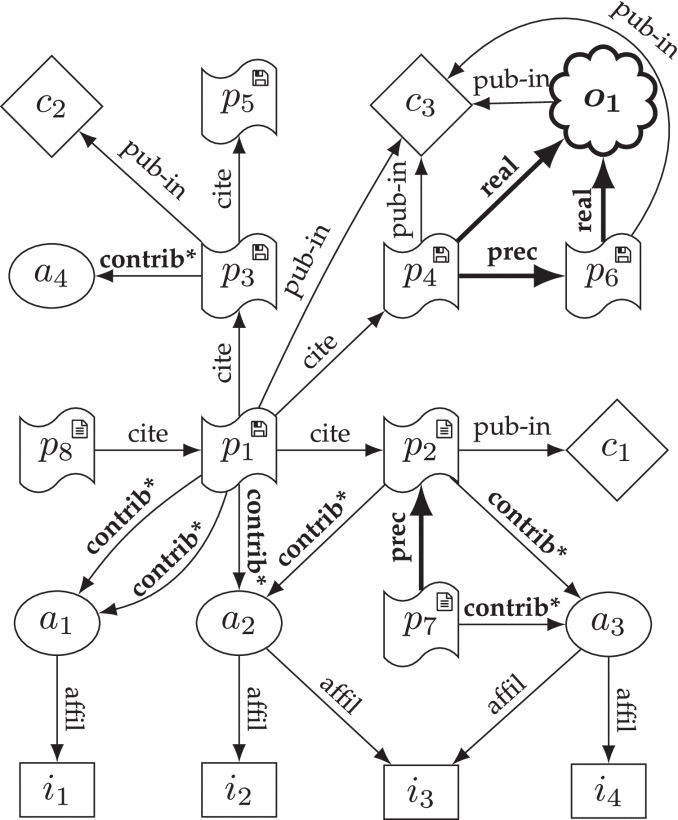

# About me

{ width="200"; align="left"; }

I am a computer science **researcher** in software engineering, at the [University Library](https://www.tu-braunschweig.de/en/ub) at [Technische Universität Braunschweig](https://www.tu-braunschweig.de/en/) and the [Department of Computer Science](https://www.informatik.hu-berlin.de/en) at [Humboldt-Universität zu Berlin](https://www.hu-berlin.de/en), and a **Fellow of the [Software Sustainability Institute (SSI)](https://software.ac.uk/)**.

In my research, I focus on the *quality* and *sustainability* of **research software**
with an emphasis on 
software supply chains and ecosystems, 
software metadata, 
research software engineering methods
and - increasingly - software security.
I am interested in understanding and improving
how people, practices, policies and infrastructure
shape how software is developed, maintained, published, cited and reused
in academic contexts and across disciplines.
For my **PhD**, I'm developing a way to measure the impact of dependencies on research software, 
to enable transitive credit,
and to make [hidden but important research dependencies](https://xkcd.com/2347/) more visible.

{ width="300"; align="right"; }

Until early 2026, I was part of the Sustainable Software Engineering Group
at the [German Aerospace Center](https://www.dlr.de/EN/Home/home_node.html)'s
[Institute of Software Technology](https://www.dlr.de/sc/en/).

[Before this](projects.md/#past-projects) I have worked as a [Research Software Engineer](https://de-rse.org/en/) in linguistics and digital humanities projects, and as Managing Editor at Wiley-Blackwell.

## Education

I received my **Magister Artium (MA)** in English Philology (major), Modern German Literature, and General and German Linguistics (minor) from the [Free University Berlin](https://www.fu-berlin.de/en/) in 2010.

## Personal

I live in Berlin, Germany, with my partner and our three kids.
